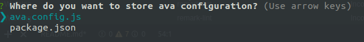
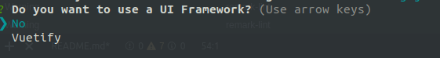

[](https://badge.fury.io/js/%40dnlup%2Fvue-cli-plugin-unit-ava)
[](https://travis-ci.com/dnlup/vue-cli-plugin-unit-ava) [](https://greenkeeper.io/)
[](https://codeclimate.com/github/dnlup/vue-cli-plugin-unit-ava/maintainability)
[](https://codeclimate.com/github/dnlup/vue-cli-plugin-unit-ava/test_coverage)


# @dnlup/vue-cli-plugin-unit-ava

> unit-ava plugin for vue-cli


## Table of contents
* [Injected commands](#injected-commands)
* [Installing in an Already Created Project](#installing-in-an-already-created-project)
* [Contributing](#contributing)

### Injected commands

- **`vue-cli-service test:unit`**

  Run unit tests with [ava](https://github.com/avajs/ava)

  **Note the tests are run inside Node.js with browser environment simulated with [browser-env](https://github.com/lukechilds/browser-env).**

  ```
  Usage: vue-cli-service test:unit [options] [<file|directory|glob> ...]

  Options:

    --watch, -w              Re-run tests when tests and source files change
    --match, -m              Only run tests with matching title (Can be repeated)
    --update-snapshots, -u   Update snapshots
    --fail-fast              Stop after first test failure
    --timeout, -T            Set global timeout
    --serial, -s             Run tests serially
    --concurrency, -c        Max number of test files running at the same time (Default: CPU cores)
    --verbose, -v            Enable verbose output
    --tap, -t                Generate TAP output
    --color                  Force color output
    --no-color               Disable color output
  ```

  Default files matches are: any files in `tests/unit` that end in `.spec.(ts|js)`.

  All [command line options](https://github.com/avajs/ava/blob/master/docs/05-command-line.md) are supported.

### Installing in an Already Created Project

```bash
$ vue add @dnlup/unit-ava
```

#### Prompts


Will merge or create a new configuration in the selected destination. It will fail if the project is already configured in the destination **not** selected.



Will add support for a specific UI Framework. It currently supports only the latest version of [Vuetify](https://vuetifyjs.com/en/).

### Contributing

* Make your changes
* Add them
  ```bash
  $ git add <your files>
  ```
* Commit (uses [commitizen](https://github.com/commitizen/cz-cli))
  ```bash
  $ npm run cz
  ```
